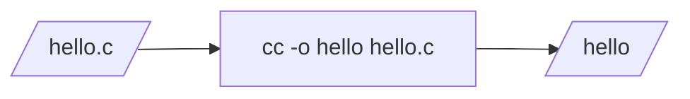

# Introducción

¿Que es un compilador? Muchas veces pensamos en el compilador como una caja
negra que traduce un programa a un ejecutable:

En este curso vamos a descomponer el trabajo del compilador en multiples fases.
Vamos a ver que hace cada fase, y vamos a implementar las fases en un lenguage
de programmación.

Vamos a aprender Diseño de Compiladores construyendo varios compiladores para
pequeños lenguajes. Esto nos ayudara a entender que es un compilador, y aprender
como funciona una computadora de una forma bien concreta. Para hacer esto, vamos
a utilizar una variedad de herramientas teoricas y practicas. En cierto sentido,
compiladores amarra mucho del material que han estudiado en el bachillerato,
desde programacion, estructuras de datos, algoritmos, teoria, y hasta
matematicas discretas.

En particular, en este curso, vamos a utilizar el lenguage
[rust](https://www.rust-lang.org/) para implementar nuestros compiladores. Rust
es un lenguaje relativamente nuevo, pero tiene mucho auge. Tiene razgos de
lenguages funcionales, y nos va a permitir trabajar de forma natural con las
estructuras que tenemos que utilizar para crear el compilador.

Como no enseñamos rust en el bachillerato, voy a dar una brevisima introduccion
al lenguage, y luego vamos a comenzar a implementar compiladores para idiomas
sencillos. Poco a poco vamos a añadair mas capacidades a nuestro lenguaje, y a
nuestro compilador. Este concepto de comenzar con un idioma sencillo e ir
implemmentando mas capacidades es el descrito en [1] y utilizado en el libro
[Essentials of Compilation An Incremental Approach de Jeremy G.
Siek](https://www.dropbox.com/s/ktdw8j0adcc44r0/book.pdf?dl=1). Ese libro
implementa scheme en un scheme, y he visto estudiantes confundir el lenguage de
implementacion y el que estan compilando. Prefiero compilar un lenguage con
otro. En otros años he utilizado un ML para el lenguage de implementacion. En
2019 use [Modern Compiler Implementation in ML by Andrew
Appel](https://www.cs.princeton.edu/~appel/modern/ml/), que utiliza
[SML/NJ](http://www.smlnj.org/). En el 2020 utilize [Ben Lerner's Spring 2020
Compiler lecture
notes](https://course.ccs.neu.edu/cs4410sp20/#%28part._lectures%29) que utiliza
[OCaml](https://ocaml.org/). Este año vamos a seguir ese material, pero
cambiando el lenguage de implementacion de ML a rust. Me gusta este acercamiento
porque al final de cada seccion tenemos un compilador que funciona. SML/NJ y
OCaml son lenguajes funcionales. Rust es parecido a los ML, asi que puede ser un
buen fundamento para un curso de compiladores. Asi espero que los estudiantes se
confundan menos, y terminen aprendiendo un lenguaje que los pueda ayudar en su
carrera profesional.

[1] Ghuloum, Abdulaziz. "An incremental approach to compiler construction."
Proceedings of the 2006 Scheme and Functional Programming Workshop, Portland,
OR. Citeseer. 2006. <http://scheme2006.cs.uchicago.edu/11-ghuloum.pdf>
