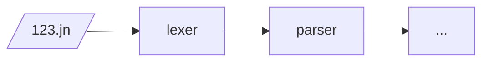

# Incrementar

Aunque tenemos un compilador, hasta yo tengo que admitir que no es muy
interesante. Solo podemos compilar programas que generen un entero de
64 bits. Para poder tenqer programas mas interesantes vamos a tener
que añadir instrucciones a nuestro compilador.

Para lograr esto vamos a utilizar unas herramientas del curso de
teoría: expressiones regulares y gramaticas libre de contexto
(context-free grammar, o CFG). Además dividiremos el compilador en
fases, donde cada fase consume lo que la anterior produce. Por ahora
nos vamos a concentrar en las primeras dos fases: "lexing" y
"parsing". Lexing utiliza expresiones regulares para dividir el input
en lexemas o "tokens". Parsing lee una lista de tokens y utiliza CFG
para dividir el input.

Rust, igual que muchos otros lenguages, tiene herramientas que pueden
generar lexers y parsers de una descripcion del
lenguage. Collectivamente estas herramientas se llaman YACC, por una
de las primeras, o "parser-generators", por su función. Vamos a
utilizar la herramienta lalrpop para generar lexers y parsers en esta
clase.

