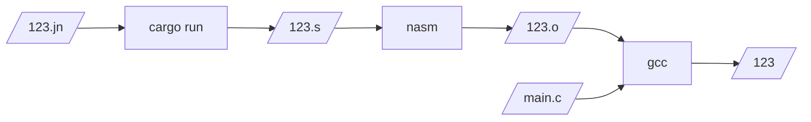

# Números

Vamos a construir un pequeño compilador que puede entender enteros.

No es un lenguaje muy interesante, pero el compilador tiene todos los razgos
principales de un compilador de verdad, y podemos ir construyendo sobre el.

Lo primero es construir un proyecto de rust para nuestro compilador. Yo lo voy a llamar `just-numbers`, para recordarme que solo puede compilar numeros.

Ve a un directorio donde quieras almacenar el proyecto y corre:
```
cargo new just-numbers
```
esto crea un nuevo directorio `just-numbers` con varios archivos, incluyendo
`Cargo.toml` y `src/main.rs`. Cambiense a este nuevo directorio en la consola.

La funcion `main` solo tiene un hello world. Vamos a modificarlo para leer un
numero de un archivo, e imprimir ensamblador de x86_64 para almacenar el numero
en el registro `rax`.

```rust
{{#include src/main.rs}}
```
Si tuvieramos un archivo como `123.jn` que tiene adentro solo el numero `123` podrimamos compilarlo con las siguientes instrucciones:
```bash
cargo build
cargo run 123.jn > 123.s
```
Y el archivo `123.s` contendria las instrucciones en assembly para devolver 123.
```assembly
{{#include 123.s}}
```
La etiqueta `our_code_starts_here` dejaria 123 en el registro `rax`.

Ahora necesitamos un programa que reciba este resultado y haga algo util. En nuestro caso, vamos a hacer un programa en C que imprima el resultado.
```C
{{#include main.c}}
```
Este programa declara `our_code_starts_here` como una funcion externa en assembly, y la llama, guardando el resultado en `result`. Luego imprime el resultado.

Ahora estamos listos para combinar el programa en C (nuestro "runtime") con el programa en assembly para hacer un programa completo.

```bash
nasm -f elf64 -o 123.o 123.s
gcc -g -o 123 main.c 123.o
```
*_En la Mac, pueden ensamblar sustituyendo `-f elf64` por `-f macho64`._

Si todo salio bien, si corren `./123` debe salir `123` en pantalla. 

# Conclusión



¡Hicimos un compilador! No parece mucho, y es algo frágil, pero tiene todos los
componentes principales: lee un programa en ASCII, lo convierte a una
representacion binaria, y lo traduce a lenguage de máquina. Hicimos varias
trampas y usamos algunos trucos, pero funciona, y no es complicado (cabe en 19
lineas de rust).

En los siguientes capitulos haremos mas compiladores, y utilizaremos
herramientas mas sofisticadas.
